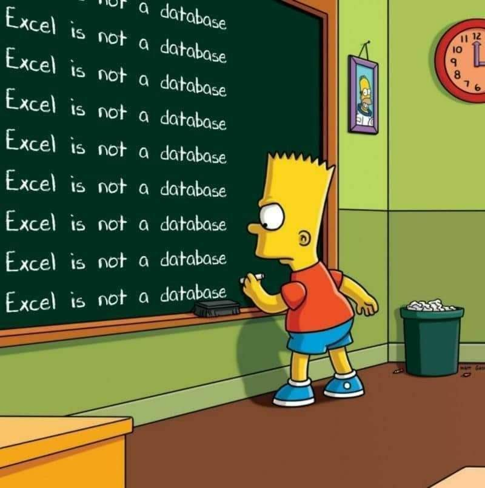

> ## Things You’ll Need To Complete This Tutorial
> #### Spreadsheet Software
> To work through this tutorial you will need access to a spreadsheet program.
> Many computers come with a pre-installed spreadsheet program like Excel. macOS users who use Apple’s Numbers application should note that it does not contain some of the features (particularly data validation) that we will be using. Please use LibreOffice or Microsoft Excel instead.

> If you do not have a spreadsheet program, install one using the instructions
> in the link below.
> * [Instructions to install a spreadsheet program.](../setup.html)
>
{: .prereq}

Good data organization is the foundation of your research
project. Most researchers have data or do data entry in
spreadsheets. Spreadsheet programs are very useful graphical
interfaces for designing data tables and handling very basic data
quality control functions.

### Spreadsheet outline

In this lesson, we’re going to talk about:

- Good data entry practices - formatting data tables in spreadsheets
- How to avoid common formatting mistakes
- Recognising and reformatting dates in spreadsheets
- Basic quality control and data manipulation in spreadsheets
- Exporting data from spreadsheets

### Spreadsheet programs

Many spreadsheet programs are available. We will use Microsoft Excel in our examples.
Although it is not open source software it is very widely available and used.

Free spreadsheet programs such as LibreOffice are available.
The functionality of these may differ from Excel, but in general they can be used to perform similar tasks.

## Problems with Spreadsheets

Spreadsheets are good for data entry,
but in reality we tend to use spreadsheet programs for much more than data entry.
We use them to create data tables for publications,
to generate summary statistics,
and make figures.
Laying out spreadsheets in this way often adds some difficulty when we want
to take our data from the spreadsheet and use it in another program.
Additional white space, merged cells, colour and grids
may aid readability but are not easily handled by other programs
that take our spreadsheet as an input to further analysis.

Generating statistics and figures in spreadsheets should be done with caution.
The graphical, drag and drop nature of spreadsheet programs means that it can be very difficult, if not impossible, to replicate your steps (much less retrace anyone else’s).
This is particularly true if your stats or figures require complex calculations.
Furthermore, when performing calculations in a spreadsheet, it’s easy to accidentally apply a slightly different formula to multiple adjacent cells.
This often makes it difficult to demonstrate data quality and consistency in our analysis.

Even when we are aware of some of the limitations that data in spreadsheets presents,
often we have inherited spreadsheets from another colleague or data provider.
In these situations we cannot exercise any control in its construction
or entry of the data within it.
Nevertheless it is important to be aware of the limitations these data may present, and know how to assess if any problems are present and how to overcome them.

> ## What this lesson will not teach you
>
> - How to do *statistics* in a spreadsheet
> - How to do *plotting* in a spreadsheet
> - How to *write code* in spreadsheet programs
>
> If you're looking to do this, a good reference is
> [Head First Excel](https://www.amazon.com/Head-First-Excel-learners-spreadsheets/dp/0596807694/ref=sr_1_1?ie=UTF8&qid=1491594584&sr=8-1&keywords=head+first+excel), published by O'Reilly.
{: .callout}

> ## Exercise
> - How many people have used spreadsheets in their research?
> - How many people have accidentally done something that made them
> frustrated or sad?
{: .challenge}

### Using Spreadsheets for Data Entry and Cleaning

However, there are circumstances where you might want to use a spreadsheet
program to produce “quick and dirty” calculations or figures, and some of
these features can be used in data cleaning, prior to importation into a
statistical analysis program. We will show you how to use some features of
spreadsheet programs to check your data quality along the way and produce
preliminary summary statistics.

In this lesson, we will assume that you are most likely using Excel as
your primary spreadsheet program - there are other programs with similar functionality but Excel seems
to be the most commonly used.

In this lesson we're going to talk about:

1. [Formatting data tables in spreadsheets](../01-format-data/)
2. [Formatting problems](../02-common-mistakes/)
3. [Dates as data](../03-dates-as-data/)
4. [Quality control](../04-quality-assurance/)
5. [Exporting data](../05-exporting-data/)


