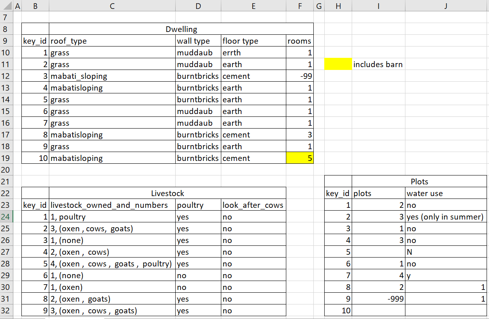
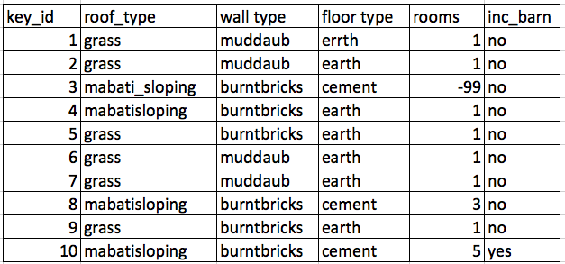
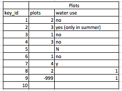

## Common Spreadsheet Errors

This lesson is meant to be used as a reference for discussion as learners identify issues with the messy dataset discussed in the
previous lesson. Instructors: don't go through this lesson except to refer to responses to the exercise in the previous lesson.

There are a few potential errors to be on the lookout for in your own data as well as data from collaborators or the Internet. If you are aware of the errors and the possible negative effect on downstream data analysis and result interpretation, it might motivate yourself and your project members to try and avoid them. Making small changes to the way you format your data in spreadsheets, can have a great impact on efficiency and reliability when it comes to data cleaning and analysis.

- [Using multiple tables](#tables)
- [Using multiple tabs](#tabs)
- [Not filling in zeros](#zeros)
- [Using problematic null values](#null)
- [Using formatting to convey information](#formatting)
- [Using formatting to make the data sheet look pretty](#formatting_pretty)
- [Placing comments or units in cells](#units)
- [Entering more than one piece of information in a cell](#info)
- [Using problematic field names](#field_name)
- [Using special characters in data](#special)

##  Using multiple tables

A common strategy is creating multiple data tables within
one spreadsheet. This confuses the computer, so don't do this!
When you create multiple tables within one
spreadsheet, you’re drawing false associations between things for the computer,
which sees each row as an observation. You’re also potentially using the same
field name in multiple places, which will make it harder to clean your data up
into a usable form. The example below depicts the problem:

{:height="80%" width="80%"}

In the example above, the computer will see (for example) row 24 and assume that all columns A-J 
refer to the same sample. This row actually represents two distinct samples 
(information about livestock for informant 1 and information about plots for informant 2). Other rows are similarly problematic.

##  Using multiple tabs

But what about workbook tabs? That seems like an easy way to organize data, right? Well, yes and no. When you create extra tabs, you fail
to allow the computer to see connections in the data that are there (you have to introduce spreadsheet application-specific functions or
scripting to ensure this connection). Say, for instance, you make a separate tab for each day you take a measurement.

This isn't good practice for two reasons:
1) you are more likely to accidentally add inconsistencies to your data if each time you take a measurement, you start recording data in a new tab, and
2) even if you manage to prevent all inconsistencies from creeping in, you will add an extra step for yourself before you analyze the
data because you will have to combine these data into a single datatable. You will have to explicitly tell the computer how to combine
tabs - and if the tabs are inconsistently formatted, you might even have to do it manually.

For these and other reasons, it is good practice to avoid creating new tabs to organize your spreadsheet data. The next time you’re entering data, and you go to create another tab or table, ask yourself if you could avoid adding this tab by adding another column to your original spreadsheet. You may, however, use a new tab to store notes about your data, such as steps you've taken to clean or manipulate your data. 

Your data sheet might get very long over the course of the experiment. This makes it harder to enter data if you can’t see your headers
at the top of the spreadsheet. But don't repeat your header row. These can easily get mixed into the data, 
leading to problems down the road.

Instead you can freeze the column headers so that they remain visible even when you have a spreadsheet with many rows.

[Documentation on how to freeze column headers](https://support.office.com/en-ca/article/Freeze-column-headings-for-easy-scrolling-57ccce0c-cf85-4725-9579-c5d13106ca6a)

##  Not filling in zeros

It might be that when you're measuring something, it's
usually a zero, say the number of cows that an informant has, in a
region where most farmers have goats and no cows. Why bother
writing in the number zero in that column, when it's mostly zeros?

{:height="80%" width="80%"}

However, there's a difference between a zero and a blank cell in a spreadsheet. To the computer, a zero is actually data. You measured
or counted it. A blank cell means that it wasn't measured and the computer will interpret it as an unknown value (otherwise known as a
null value). 

The spreadsheets or statistical programs will likely mis-interpret blank cells that you intend to be zeros. By not entering the value of
your observation, you are telling your computer to represent that data as unknown or missing (null). This can cause problems with 
subsequent calculations or analyses. For example, the average of a set of numbers which includes a single null value is always null
(because the computer can't guess the value of the missing observations). Because of this, it's very important to record zeros as zeros and truly missing data as nulls.

##  Using problematic null values
**Example**: using -999 or other numerical values (or zero) to represent missing data.

**Solution**: One common practice is to record unknown or missing data as -999, 999, or 0. Many statistical programs will not recognize
that these are intended to represent missing (null) values. How these values are interpreted will depend on the software you use to
analyze your data. It is essential to use a clearly defined and consistent null indicator.
Blanks (most applications) and NA (for R) are good choices. White et al, 2013, explain good choices for indicating null values for different software applications in their article:
[Nine simple ways to make it easier to (re)use your data.](https://ojs.library.queensu.ca/index.php/IEE/article/view/4608) Ideas in Ecology and Evolution.

##  Using formatting to convey information 

**Example**: highlighting cells, rows or columns that should be excluded from an analysis, leaving blank rows to indicate separations in data.

**Solution**: create a new field to encode which data should be excluded.

##  Using formatting to make the data sheet look pretty

**Example**: merging cells.

**Solution**: If you’re not careful, formatting a worksheet to be more aesthetically pleasing can compromise your computer’s ability to
see associations in the data. Merged cells will make your data unreadable by statistics software. Consider restructuring your data in
such a way that you will not need to merge cells to organize your data.

##  Placing comments or units in cells

**Example**: Some of your informants only irrigate their plots at certain times of the year. You've added this information as notes directly into the cell with the data. 

**Solution**: Most analysis software can't see Excel or LibreOffice comments, and would be confused by comments placed within your data
cells. As described above for formatting, create another field if you need to add notes to cells. Similarly, don’t include units in
cells: ideally, all the measurements you place in one column should be in the same unit, but if for some reason they aren’t, create
another field and specify the units the cell is in.

##  Entering more than one piece of information in a cell

**Example**: Your informant has multiple livestock of different types. You record this information as "3, (oxen , cows)" to indicate that there are three total livestock, which is a mixture of oxen and cows.

**Solution**: Don't include more than one piece of information in a cell. This will limit the ways in which you can analyze your data. 
If you need both these types of information (the total number of animals and the types), design your data sheet to include this information. For example, include a separate column for each type of livestock. 

##  Using problematic field names
Choose descriptive field names, but be careful not to include spaces, numbers, or special characters of any kind. Spaces can be
misinterpreted by parsers that use whitespace as delimiters and some programs don’t like field names that are text strings that start
with numbers.  

Underscores (`_`) are a good alternative to spaces. Consider writing names in camel case (like this: ExampleFileName) to improve
readability. Remember that abbreviations that make sense at the moment may not be so obvious in 6 months, but don't overdo it with names
that are excessively long. Including the units in the field names avoids confusion and enables others to readily interpret your variable names. Avoid starting variable names with numbers, as this may cause problems with some analysis software.

**Examples**  

<table align = "left" style = "width =50%; border: 1px solid black;">
<tr>
	<td> <b>Good Name</b></td>  
	<td> <b>Good Alternative </b> </td> 
	<td> <b>Avoid </b></td> 
</tr>
<tr>
	<td> wall_type </td>
	<td> WallType </td>
	<td> wall type </td>
</tr>
<tr>
	<td> longitude </td>
	<td> GpsLongitude </td>
	<td> gps:Longitude </td>	
</tr>	
<tr>
	<td> gender </td>
	<td> gender </td>	
	<td> M/F </td>
</tr>
<tr>
	<td> Informant_01 </td>
	<td> first_informant</td>
	<td> 1st Inf</td>
</tr>
<tr>
	<td> age_18 </td>
	<td> years18</td>
	<td> 18years</td>
</tr>
</table>

##  Using special characters in data

**Example**: You treat your spreadsheet program as a word processor when writing notes, for example copying data directly from Word or
other applications.

**Solution**: This is a common strategy. For example, when writing longer text in a cell, people often include line breaks, em-dashes,
etc in their spreadsheet.  Also, when copying data in from applications such as Word, formatting and fancy non-standard characters (such
as left- and right-aligned quotation marks) are included.  When exporting this data into a coding/statistical environment or into a
relational database, dangerous things may occur, such as lines being cut in half and encoding errors being thrown.

General best practice is to avoid adding characters such as newlines, tabs, and vertical tabs.  In other words, treat a text cell as if
it were a simple web form that can only contain text and spaces.


