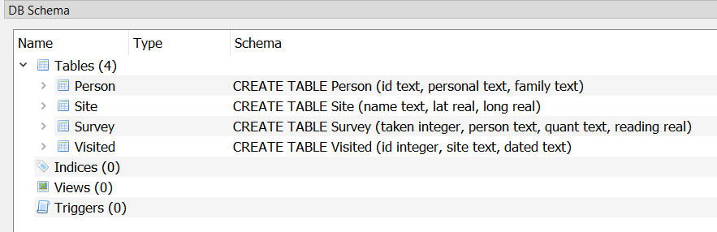

> ## Open the ocean survey in DB Browser for SQLite
>
> > 
> > 
> >
> > You should see a DB Schema tab in the interface
> >
> > Play with those arrows. What kinds of information do you think this is?
> > How might the different tables relate to each other?
> >
> > What information was stored in each table.
> > {: .sql}
> > ~~~
> > CREATE TABLE Person (id text, personal text, family text);
> > CREATE TABLE Site (name text, lat real, long real);
> > CREATE TABLE Survey (taken integer, person text, quant text, reading real);
> > CREATE TABLE Visited (id integer, site text, dated text);
> > ~~~
> > {: .output}
> >
> > We 
> > can see that the table **Person** has three 
> > columns: * **id** with type _text_ * **personal** with type _text_ 
> > * **family** with type _text_
> >
> > Note: The available data types vary based on the database manager - 
> > you can search online for what data types are supported.
> > 
> > You can change some settings to make the output easier to read.
{: .callout}

For now,
let's write an SQL query that displays scientists' names.
We do this using the SQL command `SELECT`,
giving it the names of the columns we want and the table we want them from.
Our query and its output look like this:

~~~
SELECT family, personal FROM Person;
~~~
{: .sql}

|family  |personal |
|--------|---------|
|Dyer    |William  |
|Pabodie |Frank    |
|Lake    |Anderson |
|Roerich |Valentina|
|Danforth|Frank    |

The semicolon at the end of the query
tells the database manager that the query is complete and ready to run.
We have written our commands in upper case and the names for the table and columns
in lower case,
but we don't have to:
as the example below shows,
SQL is [case insensitive]({{ page.root }}#case-insensitive).

~~~
SeLeCt FaMiLy, PeRsOnAl FrOm PeRsOn;
~~~
{: .sql}

|family  |personal |
|--------|---------|
|Dyer    |William  |
|Pabodie |Frank    |
|Lake    |Anderson |
|Roerich |Valentina|
|Danforth|Frank    |

You can use SQL's case insensitivity to your advantage. For instance,
some people choose to write SQL keywords (such as `SELECT` and `FROM`)
in capital letters and **field** and **table** names in lower
case. This can make it easier to locate parts of an SQL statement. For
instance, you can scan the statement, quickly locate the prominent
`FROM` keyword and know the table name follows.  Whatever casing
convention you choose, please be consistent: complex queries are hard
enough to read without the extra cognitive load of random
capitalization.  One convention is to use UPPER CASE for SQL
statements, to distinguish them from tables and column names. This is
the convention that we will use for this lesson.

While we are on the topic of SQL's syntax, one aspect of SQL's syntax
that can frustrate novices and experts alike is forgetting to finish a
command with `;` (semicolon).  When you press enter for a command
without adding the `;` to the end, it can look something like this:

~~~
SELECT id FROM Person
...>
...>
~~~
{: .sql}

This is SQL's prompt, where it is waiting for additional commands or
for a `;` to let SQL know to finish.  This is easy to fix!  Just type
`;` and press enter!

Now, going back to our query,
it's important to understand that
the rows and columns in a database table aren't actually stored in any particular order.
They will always be *displayed* in some order,
but we can control that in various ways.
For example,
we could swap the columns in the output by writing our query as:

~~~
SELECT personal, family FROM Person;
~~~
{: .sql}

|personal |family  |
|---------|--------|
|William  |Dyer    |
|Frank    |Pabodie |
|Anderson |Lake    |
|Valentina|Roerich |
|Frank    |Danforth|

or even repeat columns:

~~~
SELECT id, id, id FROM Person;
~~~
{: .sql}

|id      |id      |id      |
|--------|--------|--------|
|dyer    |dyer    |dyer    |
|pb      |pb      |pb      |
|lake    |lake    |lake    |
|roe     |roe     |roe     |
|danforth|danforth|danforth|

As a shortcut,
we can select all of the columns in a table using `*`:

~~~
SELECT * FROM Person;
~~~
{: .sql}

|id      |personal |family  |
|--------|---------|--------|
|dyer    |William  |Dyer    |
|pb      |Frank    |Pabodie |
|lake    |Anderson |Lake    |
|roe     |Valentina|Roerich |
|danforth|Frank    |Danforth|

> ## Understanding CREATE statements
>
> Use the `.schema` to identify column that contains integers.
>
> > ## Solution
> >
> > ~~~
> > .schema
> > ~~~
> > {: .sql}
> > ~~~
> > CREATE TABLE Person (id text, personal text, family text);
> > CREATE TABLE Site (name text, lat real, long real);
> > CREATE TABLE Survey (taken integer, person text, quant text, reading real);
> > CREATE TABLE Visited (id integer, site text, dated text);
> > ~~~
> > {: .output}
> > From the output, we see that the **taken** column in the **Survey** table (3rd line) is composed of integers.
> {: .solution}
{: .challenge}

> ## Selecting Site Names
>
> Write a query that selects only the `name` column from the `Site` table.
>
> > ## Solution
> >
> > ~~~
> > SELECT name FROM Site;
> > ~~~
> > {: .sql}
> >
> > |name      |
> > |----------|
> > |DR-1      |
> > |DR-3      |
> > |MSK-4     |
> {: .solution}
{: .challenge}

> ## Query Style
>
> Many people format queries as:
>
> ~~~
> SELECT personal, family FROM person;
> ~~~
> {: .sql}
>
> or as:
>
> ~~~
> select Personal, Family from PERSON;
> ~~~
> {: .sql}
>
> What style do you find easiest to read, and why?
{: .challenge}
